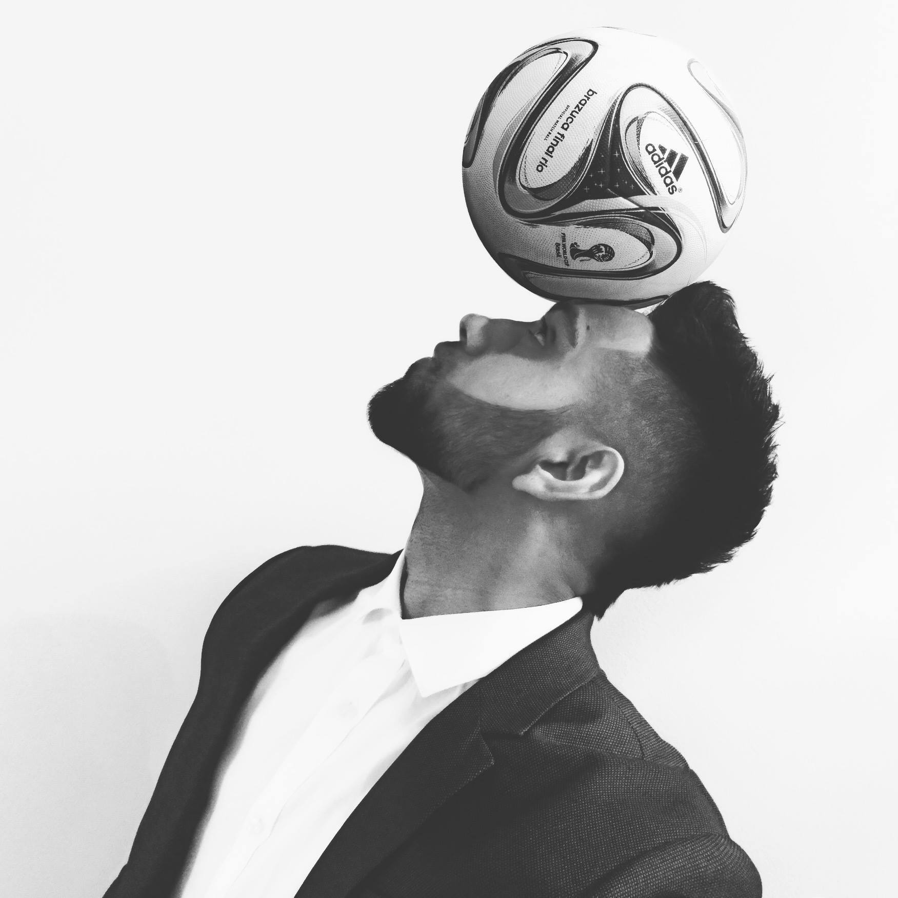

::: {#hero}
::: {.hero-container}

::: {.hero-text}
## Exploring the intersection of mathematical and biological structure.

I am a PhD researcher developing computational models and open research tools that translate complex biological measurements into interpretable representations of physiology, movement, and neurological function. My work spans wearable sensing, neuroimaging, biomechanics, and dynamical systems, with applications ranging from sport-related brain injury to Parkinson's disease.

<a class="btn-primary" href="research.qmd">Research</a>
<a class="btn-secondary" href="projects.qmd">Projects</a>
<a class="btn-secondary" href="cv.qmd">CV</a>

:::

::: {.hero-image}

:::

:::
:::

---

## Focus Areas

::: {.grid}

::: {.g-col-12 .g-col-md-4 .focus-item}
### Mathematical Modeling
Developing computational models that reveal structure and dynamics from multimodal biomedical data.

Dynamical Systems · Machine Learning · IMU · GPS · HR

:::

::: {.g-col-12 .g-col-md-4 .focus-item}
### Biological Systems
Investigating how the nervous system, physiology, and biomechanics interact across health, disease, and performance.

Neuroimaging · Physiology · Biomechanics · Biomarkers

:::

::: {.g-col-12 .g-col-md-4 .focus-item}
### Translation & Software
Building open research software and quantitative tools for scientific and clinical discovery.

Python · JavaScript · Validation · Visualization

:::

:::

---

## Experience & Education

::: {.grid}

::: {.g-col-12 .g-col-md-7}
### Current Positions

**PhD Researcher** | CIUSSS–NIM  
*Modeling TBI in sport (HR, GPS, IMU, MRI).*

**Data and Machine Learning Systems Developer** | Neurocognition & Mobility Lab (UWaterloo)  
*Building reproducible data systems for academic research.*

:::

::: {.g-col-12 .g-col-md-5}
### Education

**PhD (in-progress)** — Biomedical Sciences  
*Université de Montréal*

**MSc** — Neuroscience  
*University of Waterloo*

**Hon. BSc** — Math & Physics  
*University of Toronto*
:::

:::
